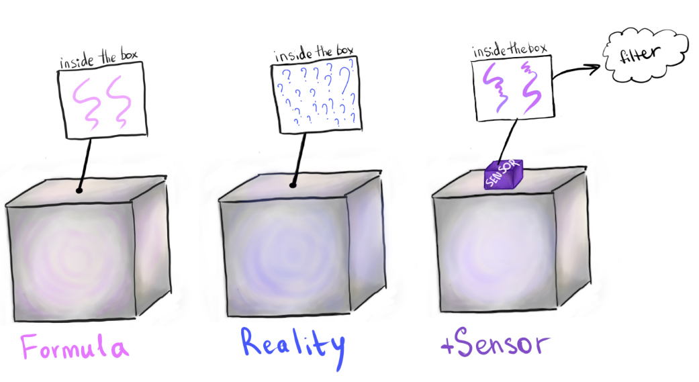
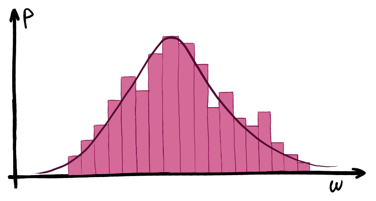
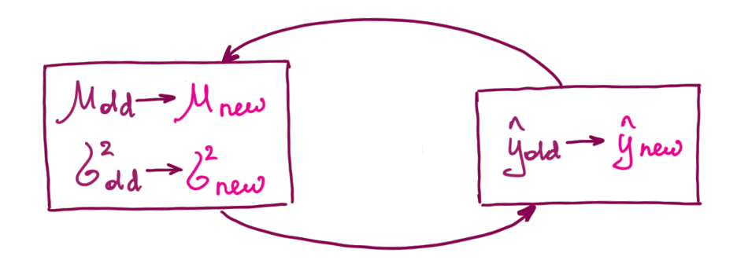
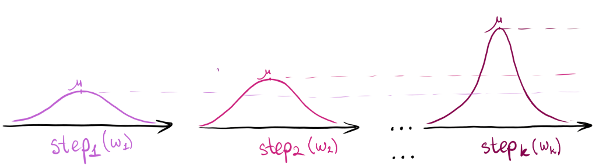
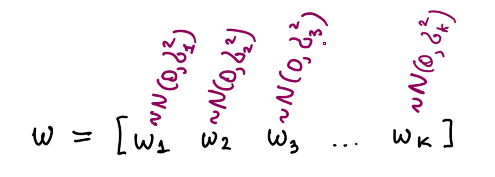

### Purpose of filters

A filter is a tool that helps us get rid of some unnecessary and/or incorrect information, and keep data that is important to us. For example, when we hear an orchestra playing, it is hard to focus on a violin, since we hear all the instruments together. So, in this situation, all the instruments except the violin are a noise that prevents us from distinguishing the violin.

In Control Theory, filters are very useful when we have some noisy data and we want to get rid of as much noise as possible, and get closer to reality. Sometimes we might have a proven mathematical formula that specifies how the system *should* work. Anyway, we can't completely rely on this formula because we can not put all the information about all the environment into this formula. That's why we use sensors to see what's actually going on in the system. And sensors, that we use to measure data, will still catch some noise (for example, simply because there are not enough sensors or they were placed not close enough to the system). So, we end up with 1) a not perfect mathematical formula and 2) noisy measurements.

The picture below shows some system inside the box and the result in some perfect environment ("Formula"), how we see it ("Reality"), and how we would see it if we used some sensor to measure the system's output ("+Sensor").

### Kalman Filter

Kalman filter is one of the possible ways to get estimate the output of a system. It is considered to be simple and effective.

#### Noise

For Kalman filter, noise is assumed to be normal (or Gaussian) with mean $\mu $ and some predefined variance $\sigma^2$ of the normal distribution. The mean value is what we want to "fix" by setting its probability high and variance can tell us how confident we are about the mean value. The smaller the variance, the more confident we can be about our mean, and, therefore, estimation. So, our goal is to minimize variance by collecting measurements from the sensors.

Look at the picture below. The $x$-axis ($w$ - noise) represents possible values for noise and the $y$-axis ($P$ - probability) represents the probability of each amount of noise. For example, the $\omega = 0$  has the highest probability. Then we see that $\sigma_1^2 < \sigma_2^2$ and it means that we're more confident about the noise that has a distribution similar to the purple line than to the pink one, because $\omega$ of the purple line converges to 0 faster than $\omega$ of the pink one.

In real life, noise is never represented by some perfect normal distribution, but it works pretty well as an assumption for the Kalman filter. An example of possible real distribution is shown in the picture below. As we see, it's pretty close to Gaussian by the shape. Also, it is possible to tune initial $\mu$ and $\sigma^2$ to fit your system.

#### The idea and formulas

##### Informal definition

The whole idea of the Kalman filter is that each new measurement improves the estimate. Mean $\mu$ and variance $\sigma^2 $ of noise are recalculated after each measurement, so the normal distribution becomes narrower, which means that the estimation becomes more confident. 

While measuring, we have process noise and observation noise. Both are assumed to be zero-mean Gaussian distribution at each step. All noises and measurement from all steps form random vectors $w$ and $v$ (see the picture below). 

##### Formal definition

**Disturbance** - unwanted inputs which affect the **control**-**system's** output
**Noise** - unwanted data that affects measurements and hides data that is important to us. There are many types of noise: additive, multiplicative, etc.

We consider a discrete linear system with both disturbance and noise.
$$
\begin{cases} x_{i+1} = Ax_i + Bu_{i+1} + w_{i+1}, \; w_{i+1} \sim \Nu(0, W)  \\ y_{i+1} = Cx_{i+1} + v_{i+1}, \; v_{i+1} \sim \Nu(0, V) \end{cases} \\ \; \\ W = \begin{cases} cov(w_i, w_j), \;\;\;\;  i\neq j \\ var(w) = \sigma_w^2,\; i=j  \end{cases} \\ V = \begin{cases} cov(v_i, v_j), \; \;\;\;\;i\neq j \\ var(v) = \sigma_v^2,\; 
i=j  \end{cases}
$$
- $x_{i+1}$ is the current state of the system and $x_{i}$ is the previous state of the system
- $u_{i+1}$ is control-input
- $A$ is the state transition matrix which is applied to $x_{i}$
- $B$ is a control-input matrix which is applied to $u_{i+1}$
- $w_{i+1}$ is process noise which is drawn from zero-mean *multivariate* normal distribution $\Nu(0, W)$. It is a random vector which has a size = amount of times we took measurements.
- $y_{i+1}$ is an observation (or measurement) of the current state $x_{i+1}$
- $C$ is the observation matrix (maps true state space into the observed space)
- $v_{i+1}$ is observation noise which is drawn from zero-mean *multivariate* normal distribution $\Nu(0,V)$. It is a random vector which has a size = amount of times we updated the system's state. Sometimes also called white noise.
- $W$ is a covariance matrix for disturbance (which is a random variable). $W$ is a square symmetric matrix. The same is applicable to $V$ - covariance matrix for noise.

If we follow the process using the picture below then the process should be clear. It shows what is observed, what is supplied by user, and what is hidden. Also, we see that the previous state affects the current state even though we can't observe it.

The rest was explained in the lecture "Observed design, Kalman filter". The notation in this document is the same as in the lecture.

### References

https://towardsdatascience.com/kalman-filter-an-algorithm-for-making-sense-from-the-insights-of-various-sensors-fused-together-ddf67597f35e

https://www.intechopen.com/books/introduction-and-implementations-of-the-kalman-filter/introduction-to-kalman-filter-and-its-applications

https://en.wikipedia.org/wiki/Kalman_filter